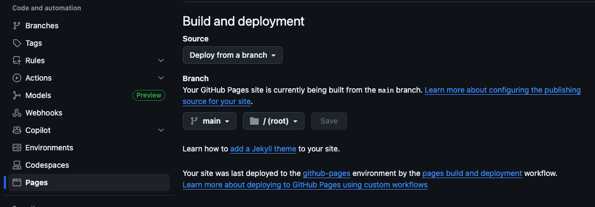

# GitHub-Pages-Deployment
This project helps you quickly put a simple `index.html` file online using GitHub Pages. It's perfect for basic websites, portfolios, or project pages. This project comes from [roadmap.sh](https://roadmap.sh/projects/github-actions-deployment-workflow)

## About This Project

This shows you how to host a basic `index.html` file directly on GitHub Pages. GitHub Pages is a free service that publishes websites straight from your GitHub repository. No complex setup or build tools are needed here – just your HTML file.

## How to Use

Follow these steps to get your `index.html` file online.

### What You Need

* A GitHub account.

* Basic understanding of Git.

### Setup

1. **Start a new repository:**

   * Fork this repository, or create a brand new one on GitHub.

2. **Add your `index.html` file:**

   * Place your `index.html` file in the main (root) folder of your repository.

   * If you're using this as a template, replace the existing `index.html`.

   Example `index.html`:

3. Enable GH Pages
   * Go to your repo settings and enable GitHub Pages
   * In my case, the Workflow is built from the *main* branch
   * This is pretty much the last step. Your next commit once pushed to Github will trigger the flow and your site will be shortly published on GitHub Pages.

   
